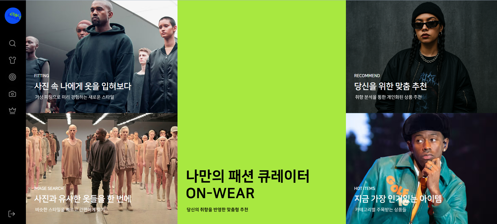
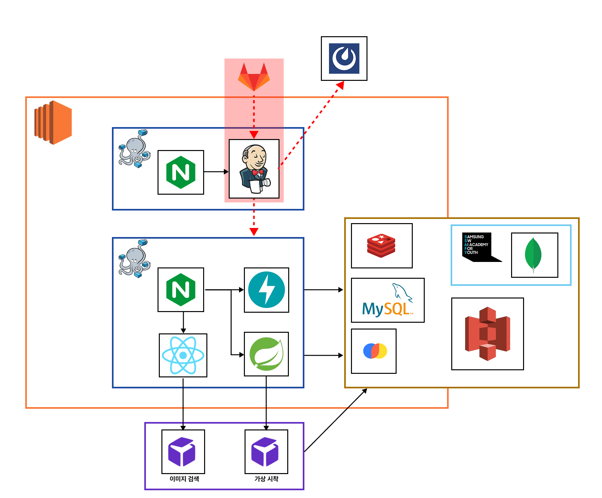

<div align="center">

# 👗 On-Wear

</div>
<div align="center">

**사진 한 장만으로 원하는 옷을 착용해볼 수 있고** 개인화된 추천 시스템으로 **맞춤형 코디 경험을 제공**하는 가상 시착 서비스<br>
**Stable Diffusion 모델로 시착을 제공**하고 **유사도 기반 검색 시스템**을 통해 맞춤형 아이템을 추천합니다.

> 사진 한 장으로 완성하는 나만의 스타일, **On-Wear**

- **개발 기간** : 2025.08.25 ~ 2025.09.29 **(4주)**
- **플랫폼** : Web Application
- **개발 인원** : 6명 <br><br>



</div> <br>

## 🔎 목차

<div align="center">

### <a href="#developers">🌟 팀원 구성</a>

### <a href="#techStack">🛠️ 기술 스택</a>

### <a href="#systemArchitecture">🌐 시스템 아키텍처</a>

### <a href="#skills">📲 기능 구성</a>

### <a href="#directories">📂 디렉터리 구조</a>

### <a href="#jiraIssues">📋 Jira 이슈 목록</a>

### <a href="#projectDeliverables">📦 프로젝트 산출물</a>

</div>
<br>

## 🌟 팀원 구성

<a name="developers"></a>

<div align="center">

<div align="center">
<table>
    <tr>
        <td width="33%" align="center"> <a href="https://github.com/01seok">
             <br> 🏋️‍♀️ 이석재 <br>(Team, BE Leader) </a> <br></td>
        <td width="33%" align="center"> <a href="https://github.com/DAN-MU-ZI">
             <br> 🍖 이재훈 <br>(Infra, AI, BE) </a> <br></td>
        <td width="33%" align="center"> <a href="https://github.com/ryongseong">
             <br> 👻 임성룡 <br>(AI, BE, Data) </a> <br></td>
    </tr>
    <tr>
      <td width="280px">
        <sub>
          - Spring Boot API <br>
          - Caching <br>
          - Search
        </sub>
      </td>
      <td width="280px">
        <sub>
          - AI 모델 통합 및 최적화 <br>
          - 인프라 및 CI/CD 설계 <br>
          - 추천 로직 구현
        </sub>
      </td>
      <td width="280px">
        <sub>
          - Data 서버 <br>
          - 데이터 수집, 전처리 <br>
          - 추천 서비스 개선
        </sub>
      </td>
    </tr>

</table>

<table>
    <tr>
        <td width="33%" align="center"> <a href="https://github.com/OPENARMS1027">
         <br> 🍥 이진모 <br>(FE Leader, Data) </a> <br></td>
        <td width="33%" align="center"> <a href="https://github.com/baekjs0123">
         <br> 🐶 백종석 <br>(FE) </a> <br></td>
        <td width="33%" align="center"> <a href="https://github.com/rnjswnghl">
         <br> 🎨 권주회 <br>(FE) </a> <br></td>
    </tr>
    <tr>
        <td width="280px">
          <sub>
            - 메인, 추천 페이지 구현 <br>
            - 상품정보 기반 벡터화 <br>
            - 추천 로직 구현
          </sub>
        </td>
        <td width="280px">
          <sub>
            - 로고 & 애니메이션효과 제작 <br>
            - E2E 테스트 <br>
            - 피팅룸 페이지 구현
          </sub>
        </td>
        <td width="280px">
          <sub>
            - 소셜 로그인, 실시간 검색색 구현 <br>
            - 인기, 검색 페이지 구현 <br>
            - 의류 상세, 검색 모달 구현
          </sub>
        </td>
    </tr>

</table>
</div>
<br>

</div>

## 🛠️ 기술 스택

<a name="techStack"></a>

### 🌕 Frontend

<div align="center">


<br>


<br>


<br>

|      **Category**       |                           **Stack**                            |
| :---------------------: | :------------------------------------------------------------: |
|      **Language**       |                        TypeScript 5.9.2                        |
| **Runtime Environment** |                        Node.js 22.17.0                         |
|      **Framework**      |              React 19.1.1, React Router DOM 7.8.2              |
|       **Library**       |       Zustand 5.0.8, Axios 1.11.0, Emotion 11.14.0,<br>        |
|   **Bundler / Tools**   |                           Vite 7.1.2                           |
| **Styling & Animation** |        Sass 1.92.1, Emotion Styled 11.14.1, GSAP 3.13.0        |
|       **Testing**       |                       Playwright 1.55.0                        |
|    **Code Quality**     | ESLint 9.34.0, Prettier 3.6.2, Husky 9.1.7, lint-staged 16.1.5 |
|         **IDE**         |                   Visual Studio Code 1.104.2                   |

</div>

### 🌑 Backend

<div align="center">


<br>


<br>


|  **Category**  |                                                                                         **Stack**                                                                                         |
| :------------: | :---------------------------------------------------------------------------------------------------------------------------------------------------------------------------------------: |
|  **Language**  |                                                                                          Java 17                                                                                          |
| **Framework**  |                                                                                     Spring Boot 3.4.9                                                                                     |
|  **Library**   | Spring Security, Spring Data JPA, Spring Data MongoDB, Spring Data Redis, Springdoc OpenAPI 2.8.7, Spring Cloud AWS S3 3.0.0-RC2, JWT (jjwt) 0.12.6, Lombok, Apache HttpComponents 4.5.14 |
|  **Database**  |                                                                          MySQL Connector, MongoDB Driver, Redis                                                                           |
|    **IDE**     |                                                                         IntelliJ IDEA 2025.1.3 (Ultimate Edition)                                                                         |
| **Build Tool** |                                                                                       Gradle 8.14.3                                                                                       |

</div>

### 🌓 Data Collection & Recommendation

<div align="center">

<br>


<br>

<br>

<br>


| **Category**  |                                            **Stack**                                             |
| :-----------: | :----------------------------------------------------------------------------------------------: |
| **Language**  |                                          Python 3.10.14                                          |
| **Framework** |                                         FastAPI 0.116.1                                          |
|  **Library**  | Requests, pydantic, uvicorn, starlette, numpy, Pillow, pymongo, aiomysql, redis, chromadb, PyJWT |
| **Database**  |                                 MySQL, MongoDB, Redis, ChromaDB                                  |
|    **IDE**    |                                    Visual Studio Code 1.104.2                                    |

</div>

### 🤖 AI

<div align="center">


<br>

<br>


<br>

<br>

#### 📋 AI 모듈 설치 가이드

|     **모듈**     |           **설명**           |                  **설치 가이드**                  |
| :--------------: | :--------------------------: | :-----------------------------------------------: |
| **embedding_db** | 이미지 임베딩 및 추천 시스템 | [📖 설치 가이드](./AI-LAB/embedding_db/README.md) |
|   **IDM-VTON**   |      가상 피팅룸 시스템      |   [📖 설치 가이드](./AI-LAB/IDM-VTON/README.md)   |

</div>

### ⚙️ DevOps

<div align="center">


<br>


<br>

<br>

|    **Category**    |          **Spec**           |
| :----------------: | :-------------------------: |
| **Instance Type**  |          T2.XLARGE          |
|      **CPU**       |           4 vCPUs           |
|      **RAM**       |            16 GB            |
| **Storage (Disk)** |         SSD: 310 GB         |
|       **OS**       |     Ubuntu 22.04.4 LTS      |
|     **Kernel**     | Linux 6.8.0-1031-aws x86_64 |
|     **Docker**     |           v28.4.0           |
| **Docker Compose** |           v2.39.2           |
|    **Jenkins**     |            2.527            |
|     **Nginx**      |        nginx/1.29.1         |
|     **RunPod**     | GPU Server (A100, Ada2000)  |

</div>

### 🗄️ Database & Storage

<div align="center">


<br>


| **Category**  |          **Stack**           |
| :-----------: | :--------------------------: |
|   **RDBMS**   |         MySQL 8.0.43         |
|   **NoSQL**   |        MongoDB 8.0.11        |
|   **Cache**   | Redis 7.4.5 (jemalloc-5.3.0) |
| **Vector DB** |              -               |
|  **Storage**  |            AWS S3            |

</div>

### 🤝 Collaboration

<div align="center">


</div>
<br>

## 🌐 시스템 아키텍처

<a name="systemArchitecture"></a>

### 🖧 System Architecture

<div align="center">


</div>

## 📲 기능 구성

<a name="skills"></a>

<div align="center">

<table>
  <tbody align="center"> 
    <tr> <th style="text-align: center"> 시착 페이지 </th> <th style="text-align: center"> 인기 페이지 </th> </tr>
    <tr> <td width="50%"></td> 
        <td width="50%"></td> </tr> </tbody>
  <tbody align="center"> 
    <tr> <th style="text-align: center"> 이미지 검색 페이지 </th> <th style="text-align: center"> 추천 페이지 </th> </tr>
    <tr> <td width="50%"></td>
    <td width="50%"></td> </tr> </tbody>
</table>
</div>
<br>

### 🎯 주요 기능

#### 1. 가상 시착 (Virtual Try-On)

사용자가 업로드한 사진과 선택한 의류 이미지를 합성해 실제로 착용한 것처럼 보여주는 기능.

- **IDM-VTON 모델**을 사용하여 옷의 주름, 패턴, 로고까지 자연스럽게 보존
- 이미지 윤곽 정보를 결합해 기존 한계였던 디테일 보존 문제를 해결
- **GPU 병렬 처리**(ONNX, CUDA, MPS)를 통해 시착 이미지 생성 시간을 단축

**활용 예시**: 사용자가 구매 전, 본인 사진으로 의상을 가상 착용해 확인

#### 2. 상품 추천 (Personalized Recommendation)

사용자의 활동 데이터를 기반으로 취향을 분석하고, 맞춤형 상품을 제안.

**행동 데이터 기반 가중치:**

- 찜하기: 10점 → 강한 선호 표현
- 상세보기: 3점 → 단순 탐색
- 시간 가중치: 최근 행동에 높은 점수를 주는 방식으로 즉각적 선호 반영

**효율성 지표**: NDCG 평가에서 상위 추천 결과가 실제 선호와 0.77까지 일치
**서비스 개선**: 벡터 DB 최적화로 추천 속도를 3초 → 0.1초(약 95.8%) 단축

**활용 예시**: 사용자가 최근 본 옷이나 찜한 아이템을 기반으로 유사한 스타일 자동 추천

#### 3. 이미지 기반 검색 (Image-based Search)

사용자가 의류 사진을 업로드하면, 해당 이미지를 분석해 유사한 아이템을 검색.

- **Fashion-CLIP 모델**을 적용해 이미지 임베딩 후 벡터 공간에서 유사도 계산
- 텍스트 입력 없이도, 단순히 사진만으로 비슷한 스타일을 탐색 가능

**활용 예시**: 길거리에서 찍은 옷 사진을 업로드해 온라인 쇼핑몰에서 유사 상품 찾기

## 📂 디렉터리 구조

<a name="directories"></a>

### 🌕 Frontend

<details align="left">
  <summary>
    <strong>Frontend</strong>
  </summary>

```
📦FrontEnd
 ┣ 📂public
 ┃ ┣ 📂fonts
 ┃ ┗ 📂img
 ┣ 📂src
 ┃ ┣ 📂common
 ┃ ┃ ┣ 📂assets
 ┃ ┃ ┣ 📂auth
 ┃ ┃ ┣ 📂clothes_detail
 ┃ ┃ ┣ 📂components
 ┃ ┃ ┣ 📂core
 ┃ ┃ ┣ 📂layouts
 ┃ ┃ ┣ 📂navbar
 ┃ ┃ ┣ 📂stores
 ┃ ┃ ┗ 📂styles
 ┃ ┣ 📂features
 ┃ ┃ ┣ 📂fittingroom
 ┃ ┃ ┣ 📂hotitems
 ┃ ┃ ┣ 📂imagesearch
 ┃ ┃ ┣ 📂main
 ┃ ┃ ┣ 📂recommend
 ┃ ┃ ┗ 📂search
 ┃ ┣ 📂styles
 ┃ ┣ 📜App.tsx
 ┃ ┣ 📜main.tsx
 ┃ ┗ 📜vite-env.d.ts
 ┣ 📂test
 ┣ 📂docs
 ┣ 📂.gitlab
 ┣ 📂.husky
 ┣ 📜.gitattributes
 ┣ 📜.gitignore
 ┣ 📜.prettierignore
 ┣ 📜.prettierrc
 ┣ 📜Dockerfile
 ┣ 📜Jenkinsfile.dev
 ┣ 📜README.md
 ┣ 📜eslint.config.js
 ┣ 📜eslint.config.ts
 ┣ 📜index.html
 ┣ 📜package.json
 ┣ 📜package-lock.json
 ┣ 📜playwright.config.ts
 ┣ 📜test-run-guide.md
 ┣ 📜tsconfig.app.json
 ┣ 📜tsconfig.json
 ┣ 📜tsconfig.node.json
 ┣ 📜vite.config.ts
 ┗ 📜vite-env.d.ts
```

</details>

### 🌑 Backend

<details align="left">
  <summary>
    <strong>Backend</strong>
  </summary>

```
📦BackEnd
 ┣ 📂src
 ┃ ┣ 📂main
 ┃ ┃ ┣ 📂java
 ┃ ┃ ┃ ┗ 📂com
 ┃ ┃ ┃ ┃ ┗ 📂busantong
 ┃ ┃ ┃ ┃ ┃ ┗ 📂onwear
 ┃ ┃ ┃ ┃ ┃ ┃ ┣ 📂api
 ┃ ┃ ┃ ┃ ┃ ┃ ┃ ┣ 📂coordination
 ┃ ┃ ┃ ┃ ┃ ┃ ┃ ┣ 📂mannequin
 ┃ ┃ ┃ ┃ ┃ ┃ ┃ ┣ 📂member
 ┃ ┃ ┃ ┃ ┃ ┃ ┃ ┣ 📂my
 ┃ ┃ ┃ ┃ ┃ ┃ ┃ ┣ 📂product
 ┃ ┃ ┃ ┃ ┃ ┃ ┃ ┣ 📂search
 ┃ ┃ ┃ ┃ ┃ ┃ ┃ ┗ 📂tryon
 ┃ ┃ ┃ ┃ ┃ ┃ ┗ 📂global
 ┃ ┃ ┃ ┃ ┃ ┃ ┃ ┣ 📂config
 ┃ ┃ ┃ ┃ ┃ ┃ ┃ ┣ 📂exception
 ┃ ┃ ┃ ┃ ┃ ┃ ┃ ┣ 📂redis
 ┃ ┃ ┃ ┃ ┃ ┃ ┃ ┣ 📂response
 ┃ ┃ ┃ ┃ ┃ ┃ ┃ ┣ 📂security
 ┃ ┃ ┃ ┃ ┃ ┃ ┃ ┗ 📂support
 ┃ ┃ ┃ ┃ ┃ ┃ ┗ 📜OnwearApplication.java
 ┃ ┃ ┗ 📂resources
 ┃ ┃ ┃ ┣ 📜application.yml
 ┃ ┃ ┃ ┣ 📜application-local.yml
 ┃ ┃ ┃ ┗ 📜application-prod.yml
 ┃ ┗ 📂test
 ┃ ┃ ┗ 📂java
 ┃ ┃ ┃ ┗ 📂com
 ┃ ┃ ┃ ┃ ┗ 📂busantong
 ┃ ┃ ┃ ┃ ┃ ┗ 📂onwear
 ┃ ┃ ┃ ┃ ┃ ┃ ┣ 📂api
 ┃ ┃ ┃ ┃ ┃ ┃ ┃ ┣ 📂coordination
 ┃ ┃ ┃ ┃ ┃ ┃ ┃ ┣ 📂mannequin
 ┃ ┃ ┃ ┃ ┃ ┃ ┃ ┣ 📂product
 ┃ ┃ ┃ ┃ ┃ ┃ ┃ ┗ 📂tryon
 ┃ ┃ ┃ ┃ ┃ ┃ ┣ 📂global
 ┃ ┃ ┃ ┃ ┃ ┃ ┃ ┣ 📂response
 ┃ ┃ ┃ ┃ ┃ ┃ ┃ ┗ 📂security
 ┃ ┃ ┃ ┃ ┃ ┃ ┗ 📜OnwearApplicationTests.java
 ┣ 📂.gitlab
 ┃ ┗ 📂merge_request_templates
 ┃ ┃ ┣ 📜Feature.md
 ┃ ┃ ┣ 📜Hotfix.md
 ┃ ┃ ┗ 📜Merge.md
 ┣ 📜build.gradle
 ┣ 📜Dockerfile
 ┣ 📜Jenkinsfile.dev
 ┣ 📜settings.gradle
 ┗ 📜.gitignore
```

</details>

### 🌑 Data Server

<details align="left">
  <summary>
    <strong>Data Server</strong>
  </summary>

```
📦Data
 ┣ 📂auth
 ┣ 📂crawl
 ┣ 📂recommend
 ┣ 📂user
 ┣ 📂utils
 ┣ 📂logs
 ┣ 📜main.py
 ┣ 📜requirements.txt
 ┣ 📜Dockerfile
 ┣ 📜Jenkinsfile.dev
 ┣ 📜README.md
 ┗ 📜.gitignore
```

</details>

### 🤖 AI & Data

<details align="left">
  <summary>
    <strong>AI-LAB</strong>
  </summary>

```
📦AI-LAB
 ┣ 📂embedding_db
 ┃ ┣ 📜client_image_load.py
 ┃ ┣ 📜main.py
 ┃ ┣ 📜server_image_search_gpu.py
 ┃ ┗ 📜requirements.txt
 ┣ 📂IDM-VTON
 ┃ ┣ 📂ckpt
 ┃ ┣ 📂configs
 ┃ ┣ 📂gradio_demo
 ┃ ┣ 📂preprocess
 ┃ ┣ 📂src
 ┃ ┣ 📂ip_adapter
 ┃ ┣ 📜inference.py
 ┃ ┣ 📜idm_tmp.py (주 서버)
 ┃ ┣ 📜server.py
 ┃ ┗ 📜requirements.txt
 ┗ 📂Data
    ┣ 📂auth
    ┣ 📂crawl
    ┣ 📂recommend
    ┣ 📂user
    ┣ 📂utils
    ┣ 📜main.py
    ┗ 📜requirements.txt
```

</details>
<br>

## 📦 프로젝트 산출물

<a name="projectDeliverables"></a>

### 🎯 주요 모델

#### CLIP (patrickjohncyh/fashion-clip)

- [huggingface](https://huggingface.co/patrickjohncyh/fashion-clip)
- 패션 아이템 이미지 임베딩 및 유사도 검색

#### VTON (yisol/IDM-VTON)

- [huggingface](https://huggingface.co/spaces/yisol/IDM-VTON)
- [github](https://github.com/yisol/IDM-VTON)
- 가상 시착 이미지 생성

#### Image Captioning (Salesforce/blip-image-captioning-large)

- [huggingface](https://huggingface.co/Salesforce/blip-image-captioning-large)
- 이미지 설명 생성 및 텍스트 기반 검색

### 📄 라이선스

이 프로젝트의 모든 소프트웨어, 라이브러리 및 AI 모델은 다음과 같은 라이선스를 따릅니다:

#### 🎯 주요 AI 모델 라이선스

**IDM-VTON (가상 시착 모델)**

- **라이선스**: Creative Commons Attribution-NonCommercial-ShareAlike 4.0 International
- **원본 소스**: [yisol/IDM-VTON](https://github.com/yisol/IDM-VTON)
- **제약사항**: 비상업적 용도로만 사용 가능, 동일한 라이선스로 재배포 필요

**Fashion-CLIP (패션 이미지 임베딩)**

- **라이선스**: MIT License
- **원본 소스**: [patrickjohncyh/fashion-clip](https://huggingface.co/patrickjohncyh/fashion-clip)
- **제약사항**: 상업적 사용 가능, 저작권 표시 필요

**BLIP Image Captioning**

- **라이선스**: Apache 2.0 License
- **원본 소스**: [Salesforce/blip-image-captioning-large](https://huggingface.co/Salesforce/blip-image-captioning-large)
- **제약사항**: 상업적 사용 가능, 라이선스 사본 포함 필요

#### 📋 라이선스 요약

**AI 모델**
| 모델 | 라이선스 | 상업적 사용 | 저작권 표시 | 재배포 조건 |
|------|----------|-------------|-------------|-------------|
| IDM-VTON | CC BY-NC-SA 4.0 | ❌ | ✅ | 동일 라이선스 |
| Fashion-CLIP | MIT | ✅ | ✅ | 자유 |
| BLIP Captioning | Apache 2.0 | ✅ | ✅ | 라이선스 포함 |

#### ⚠️ 주요 제약사항

**IDM-VTON 모델 사용 시:**

- ✅ 연구 및 교육 목적으로 자유롭게 사용 가능
- ✅ 개인적, 비상업적 용도로 사용 가능
- ❌ 상업적 목적으로 사용 불가
- ❌ 라이선스 조건 변경 불가

**전체 프로젝트:**

- 이 프로젝트는 비상업적 연구 및 교육 목적으로만 사용됩니다
- 상업적 이용을 원하는 경우 각 모델의 원본 라이선스를 확인하시기 바랍니다

**특별 주의사항:**

- **MySQL Connector**: GPL 2.0 라이선스로 상업적 사용 시 주의 필요
- **GSAP**: 상업적 프로젝트에서 사용 시 유료 라이선스 필요
- **IDM-VTON**: 비상업적 용도로만 사용 가능

#### 📝 사용 조건

이 소프트웨어를 사용함으로써 다음 조건에 동의하는 것으로 간주됩니다:

1. 각 모델의 원작자에 대한 적절한 저작권 표시
2. IDM-VTON 모델의 경우 비상업적 목적으로만 사용
3. 2차 저작물 배포 시 해당 라이선스 조건 준수
4. 라이선스 전문을 포함하여 배포

#### 🔗 참고 링크

- [Creative Commons BY-NC-SA 4.0](https://creativecommons.org/licenses/by-nc-sa/4.0/)
- [MIT License](https://opensource.org/licenses/MIT)
- [Apache 2.0 License](https://www.apache.org/licenses/LICENSE-2.0)

### 🛠️ 개발 도구

- **API 문서**: Swagger UI
- **데이터베이스**: MySQL, MongoDB, Redis, Chroma
- **스토리지**: AWS S3
- **CI/CD**: Jenkins
- **컨테이너**: Docker, Docker Compose
